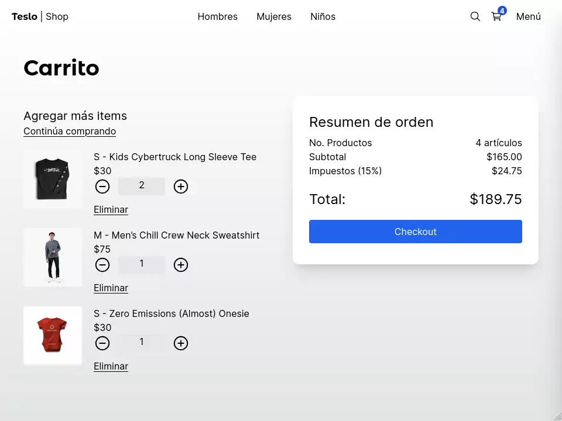

# Descripción

## Correr en dev

1. Clonar el repositorio.
2. Crear una copia del ```.env.template``` y renombrarlo a ```.env``` y cambiar las variables de entorno.
3. Instalar dependencias 
```
npm install
```
4. Levantar la base de datos 
```
docker compose up -d
```
5. Correr las migraciones de Prisma 
```
npx prisma migrate dev
```
6. Ejecutar seed 
```
npm run seed
```
7. Correr el proyecto 
```
npm run dev
```

## Stack usado
* MongoDB
* NestJS


